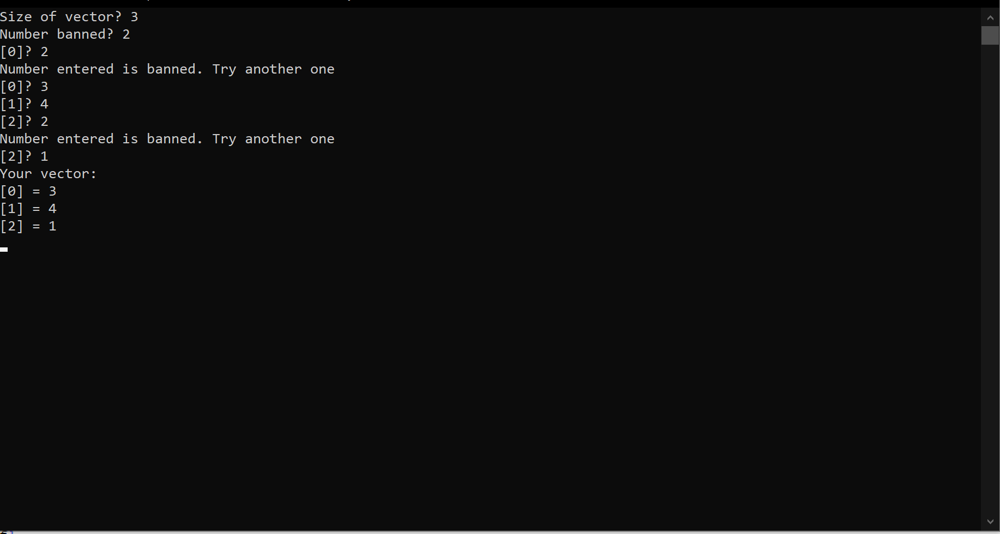
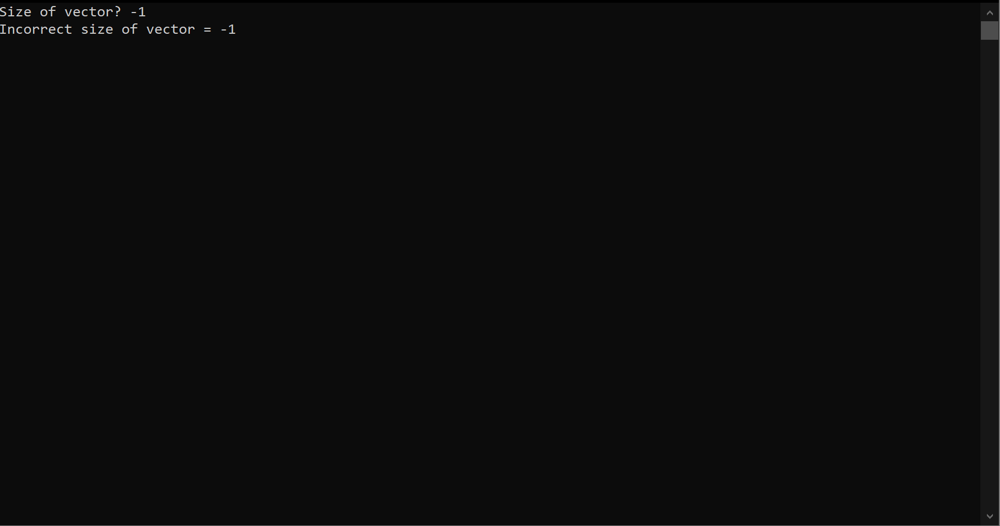
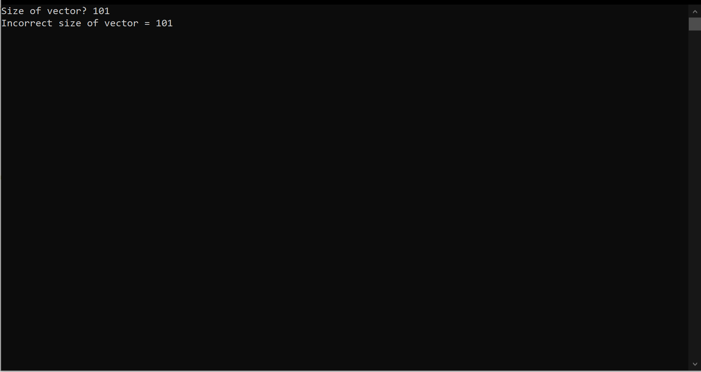
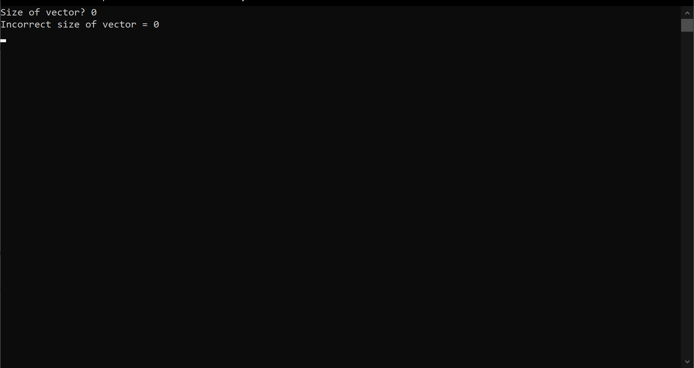

# БПИ199, Волохов Никита Алексеевич, 5 вариант
## Массив B из элементов A, значение которых не совпадают с введённым числом x

### Тест 1. Правильные входные данные и проверка на запрещенное число

### Тест 2. Значение размера массива < 1

### Тест 3. Значение размера массива > 100

### Тест 4. Значение размера массива = 0

